  

  <h1>Hey, I'm Tom 👋</h1>
  

    🎓 Student @ <strong>CEFF</strong> &nbsp;·&nbsp;
    <!-- 📱 Flutter dev &nbsp;·&nbsp; -->
  

---

### 🛠️ What I build with

---

### 📊 My GitHub in numbers

  

---

### 🚀 Featured project

---

### 📬 Find me

